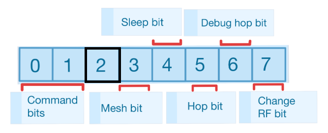
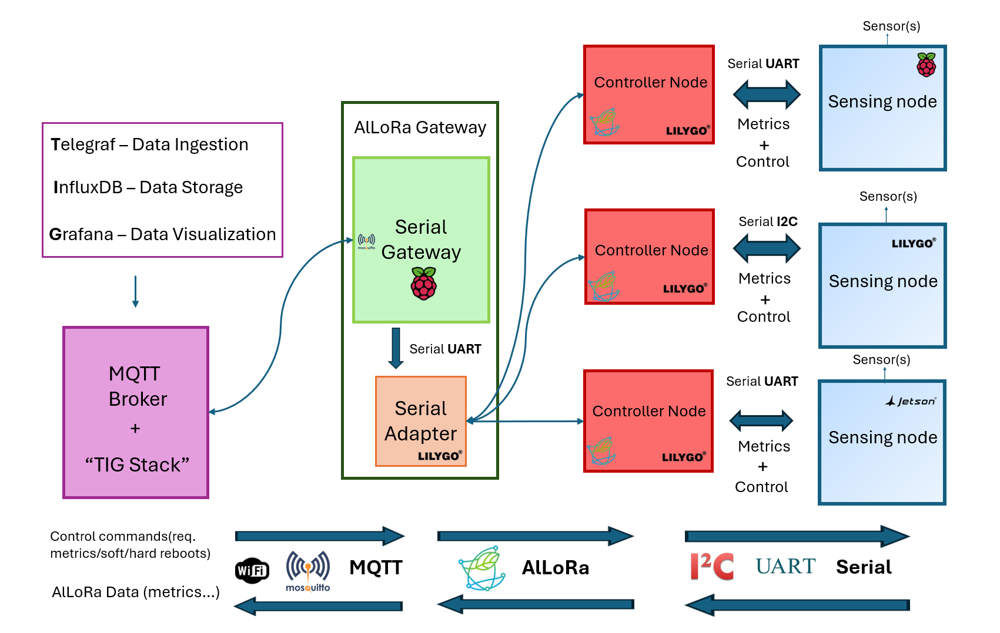
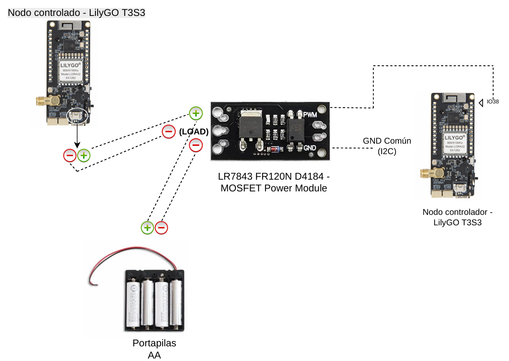
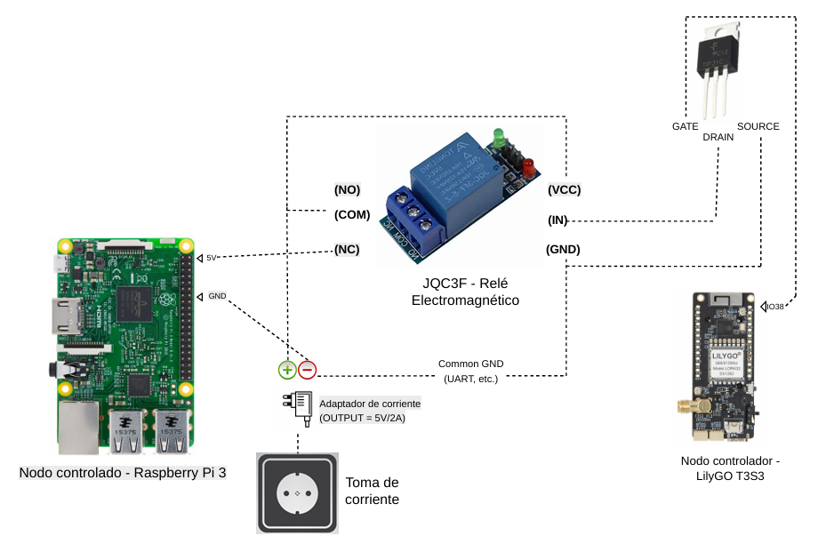

# Non-intrusive monitoring for AlLoRa

Community project for non-intrusive monitoring in AlLoRa-based deployments,
including LilyGO T3S3, Raspberry Pi, and auxiliary firmware/software
components for telemetry acquisition and supervision/control. The main objective is
to give the AlLoRa protocol some kind of "control layer" that allows
the network administrators of the deployments to remotely reset the sensor
nodes of their choice. This has been implemented in the example architecture
presented in this repository as a forceful power off + power on of those
nodes, via the cut and restoration of their power supplies.

This is not an official AlLoRa repository.

## About AlLoRa

This work is based on the AlLoRa protocol and software ecosystem by Benjamin Arratia
and other collaborators:

- Original AlLoRa repository: https://github.com/SMARTLAGOON/AlLoRa
- DOI: Arratia, B. (2025). AlLoRa (v2.0.0). Zenodo. https://doi.org/10.5281/zenodo.14811471

This repository extends that ecosystem with monitoring/supervision-oriented components and
deployment examples.

Fundamentally, AlLoRa defines itself as a "Modular, mesh and multi-device Advanced LoRa Content Transfer Protocol". Its a link-layer network protocol that improves the performance of the LoRa technology, allowing for bigger packets to be transmitted over greater distances. Some of its main features include the mesh capability -extending in great measure the range of the overall communications- and the ability to change RF parameters dynamically. For more information about the protocol, please refer to the above cited repository.

One of the key changes made to the protocol structure in this project, is the repurposing of the so-called "Retransmission bit" in the "Flags" field of the header of the AlLoRa Packet -the third one in that field-. While it receives that name, it's officially stated that it serves no purpose in the protocol, at least at the present time (April 2026). For this reason, it has been renamed as "Control bit" and now serves that precise objective: to mark down the packets intended to transmit the control commands as such. This specific aspect is represented by the following Figure. For the complete format of the AlLoRa Packet, please consult the official AlLoRa repository.

    

## Main features of the project

- Non-intrusive node monitoring for AlLoRa-based systems
- LilyGO T3S3 integration
- Raspberry Pi integration
- Telemetry transport over I2C, UART, and AlLoRa
- Monitoring-oriented examples with supervision capabilities and deployment support

## Repository structure

- [`adapter/`](adapter/) — software to be executed on the LilyGO T3S3 that serves as an adapter for the RP Gateway, so it can access the LoRa channel
- [`AlLoRa/`](AlLoRa/) — the modified AlLoRa code, intended to be used by all the nodes that execute that protocol
- [`brokerMQTT_docker/`](brokerMQTT_docker/) — all the configurations —including the docker-compose.yml— for the MQTT broker + TIG stack [consult its readme](brokerMQTT_docker/) to be run on a Raspberry Pi node (or any PC)
- [`controller_i2c/`](controller_i2c/) — software to be executed on the LilyGO T3S3 that serves as a controller node (for a LilyGO sensor node, communicating via the I2C serial protocol)
- [`controller_uart/`](controller_uart/) — software to be executed on the LilyGO T3S3 that serves as a controller node (for a RP sensor node, communicating via the UART serial protocol)
- [`docs/`](docs/) — recopilation of all the README.md files of the repository, and other useful documentation related to it
- [`firmware/`](firmware/) — embedded firmware for supported nodes. It includes the firmware to be used by the LilyGO sensor nodes, and the one designed for the general case of the rest of those LilyGO devices
- [`gateway/`](gateway/) — software to be executed on the Raspberry Pi that serves as a Gateway for the architecture
- [`lilygo_sensor_node/`](lilygo_sensor_node/) — software to be executed on the LilyGO T3S3 that serves as a sensor node
- [`PyLora_SX127x_extensions/`](PyLora_SX127x_extensions/) — original repository by GRCDEV needed for the AlLoRa code to be run successfully. As such, it's intended to be used on all the nodes running the protocol
- [`raspberry_sensor_node/`](raspberry_sensor_node/) — software to be executed on the Raspberry Pi that serves as a sensor node

## Dependencies and acknowledgements

This project relies on or is based on:

- AlLoRa: https://github.com/SMARTLAGOON/AlLoRa
- PyLora_SX127x_extensions: https://github.com/GRCDEV/PyLora_SX127x_extensions

## License

GNU GPL v3.0. See the `LICENSE` file for details.

## Citation

If you use this repository, please refer to the metadata in `CITATION.cff`.

## Network Architecture Overview
The example of network architecture designed for this proyect is shown in the subsequent diagram. The gateway nodes execute the polling of the controllers, which in turn require the data from the sensing nodes. They send the results over MQTT to the broker, and receive from it the control commands to be transmitted to those controllers.

    

The MQTT broker can interact with multiple AlLoRa Gateways, and those Gateways have their assigned controller nodes [see Nodes.json](gateway/Nodes.json)

## Control Circuits
The simple electric circuits used for allowing the hard-reboot of the terminal nodes are presented in the following diagrams. As their energetical needs differ from one another, the hardware employed in each case (LilyGO sensing node/Raspberry Pi sensing node) varies accordingly. These configurations allow for the main control/supervision function of the project to work.

### Control Circuit for LilyGO sensing nodes

    

### Control Circuit for Raspberry Pi sensing nodes

    

